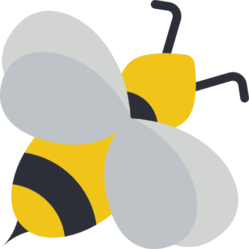

<h1 align="center"></img> WordHive </img></h1>

Project started on 7/14/23

Expected completion of MVP by 7/25/23

<h2 align="center">Description and Context</h2>

WordHive is a spin off of the New York Times Spelling Bee word game. This is a game I have loved for years, but the only drawback is when playing on the NYT app you are limited to one puzzle a day and required to pay a subscription fee to play the puzzle to completion.

Developing this application is allowing me to keep my skills sharp as I look for my first job in frontend software development. Additionally, I am able to add my own personal touch to one of my favorite word games and play as much as I want without paying the subscription fee. 

<h2 align="center">Game Rules</h2>

WordHive is a challenging and addictive puzzle that tests your vocabulary skills. Here are the basic rules:

1. Objective: The goal of the game is to create as many valid words as possible using the seven given letters while including the center letter in every word.
2. Letter Set: Each puzzle consists of a set of seven letters, including one letter in the center, which is highlighted.
3. Word Requirements: Valid words must contain at least four letters and include the center letter. The center letter must be used in every word.
4. Accepted Words: All acceptable words must be real English words found in the New York Times Word List, which is based on the Merriam-Webster Dictionary.
5. Letter Usage: You can use each letter in the set as many times as you like, but each word must be formed using only the given set of letters.
6. Word Lengths: Longer words earn more points. Words with four letters earn one point, while longer words earn additional points based on their length.
7. Pangram: A pangram is a word that uses all seven letters in the set. Finding at least one pangram is an additional challenge and earns bonus points.

<h3 align="center">Technologies Used</h3>

This application is being created using the [Free Bee API](https://freebee.fun/api.html). This API provides random game data specifically designed for the rules of the NYT spelling bee game.

